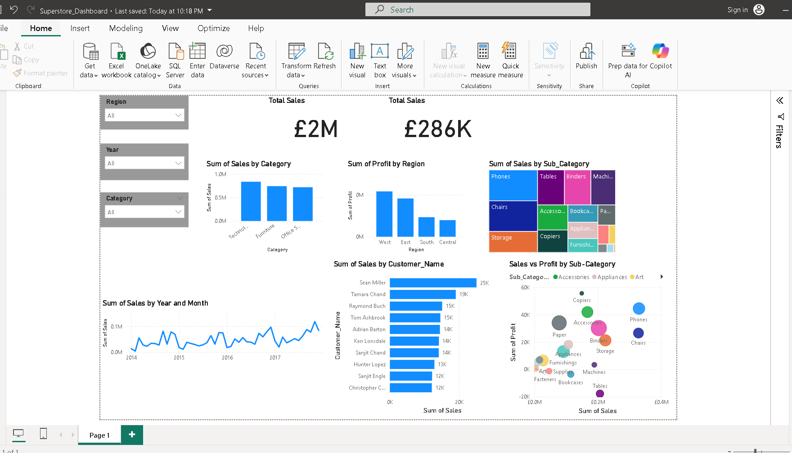

# Superstore Sales Dashboard (Power BI)

## 📌 Project Overview
This Power BI project analyzes sales and profit data from the Global Superstore dataset.  
It includes KPIs, slicers, and multiple visuals to provide actionable insights.

## 🔹 Features
- **KPIs**: Total Sales, Total Profit, Profit Margin %
- **Breakdowns**: Sales by Category, Profit by Region, Top 10 Customers
- **Trends**: Sales over time (line chart)
- **Performance**: Sales vs Profit scatter analysis

## 📷 Dashboard Preview

## 🛠 Tools
- Power BI Desktop
- Power Query
- Data Visualization & Dashboard Design

## 📂 Files
- `Superstore_Dashboard.pbix` → Power BI file
- `Superstore_Dashboard.pdf` → Exported dashboard
- `dashboard_overview.png` → Preview image
